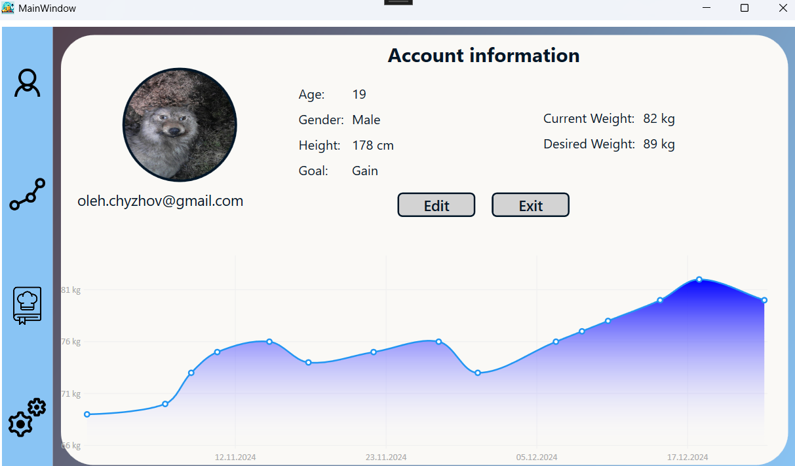
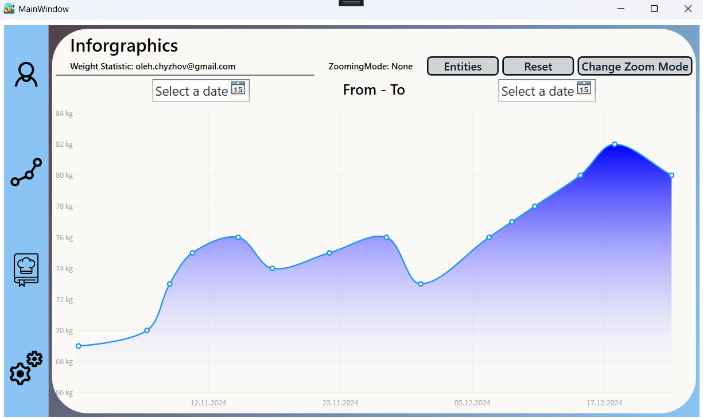
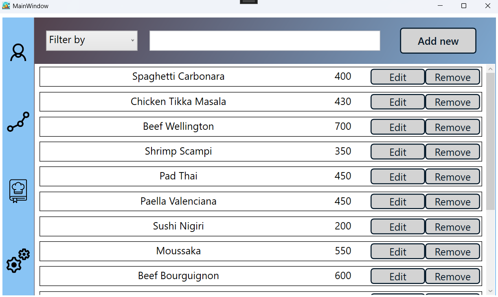
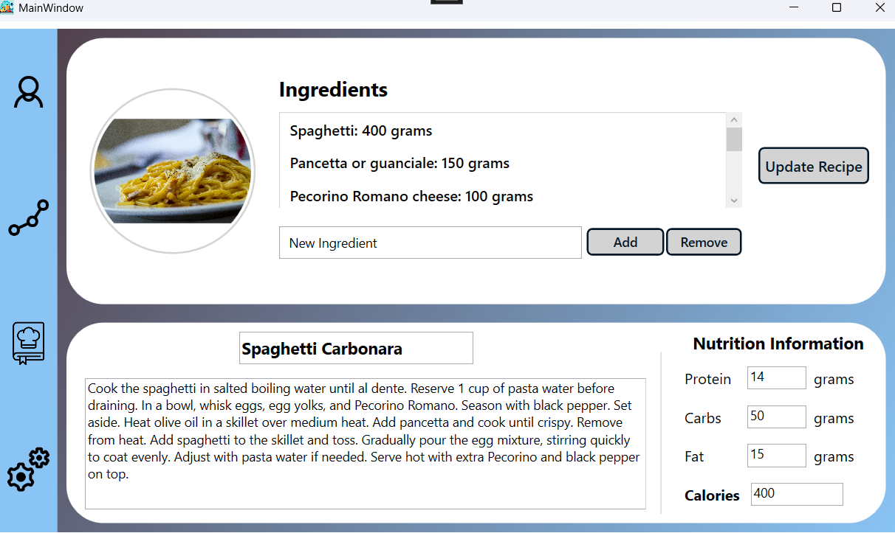
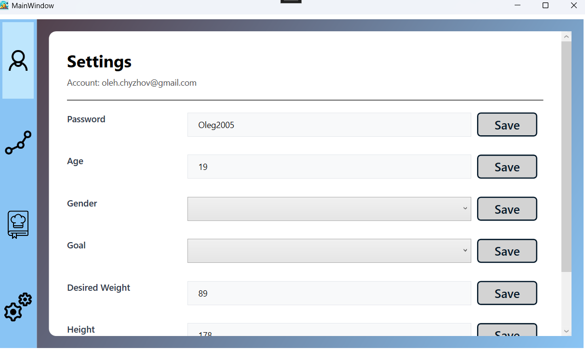

# RecipePlanner

## Overview
RecipePlanner is a WPF application designed to help users manage their recipes and track body weight statistics. In this project also implemented account and settings. The project is not finished. Requires fixes, refactoring, code cleanup, and optimization.

## Features
- **Recipe Management**: Add, edit, and delete recipes.
- **Body Weight Tracking**: Monitor and analyze weight trends.
- **User Accounts**: Create and manage user profiles.
- **Settings**: Customize the account.

## Technologies Used
- **C#** with **.NET (WPF)**
- **Entity Framework** (SQLite)
- **LiveCharts**
- **MVVM Pattern**

## Images

