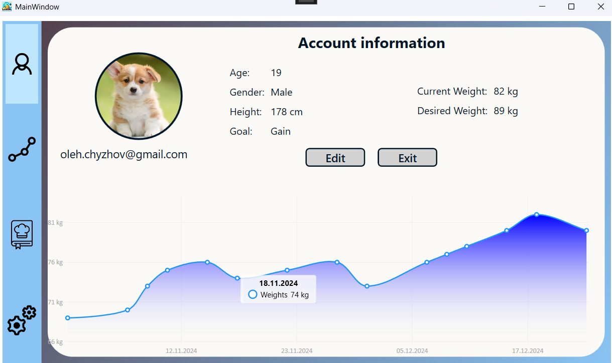

# RecipePlanner

## Overview
RecipePlanner is a WPF application for recipe management and body weight tracking. Since this is my first project, many parts of the code are messy — but that’s all part of the learning process.

## Features
- **Recipe Management**: Add, edit, and delete recipes.
- **Body Weight Tracking**: Monitor and analyze weight trends.
- **User Accounts**: Create and manage user profiles.
- **Settings**: Change account details.

## Technologies Used
- **C#** with **.NET (WPF)**
- **Entity Framework** (SQLite)
- **LiveCharts**
- **MVVM Pattern**

## Images

